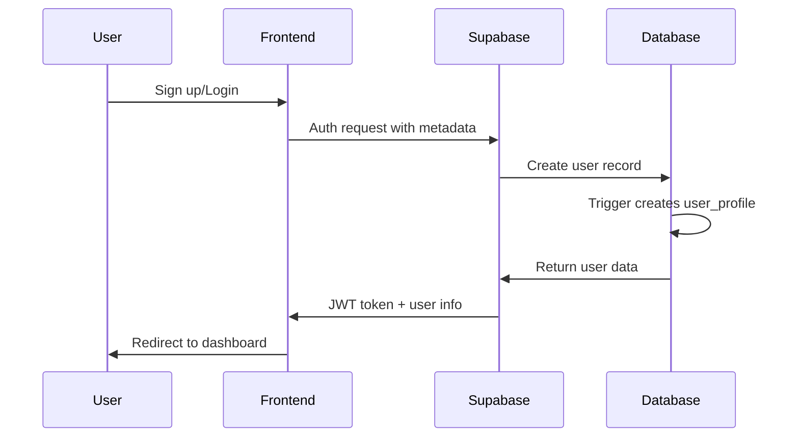

# Technical Architecture Documentation

## 🏗️ System Architecture Overview

Prospectify v2 is built using a modern, scalable architecture that combines Next.js 15 with Supabase for a robust full-stack application targeting European SMB marketing teams.

## 🔧 Core Technologies

### Frontend Architecture
```
┌─────────────────────────────────────────────────────────────┐
│                    Next.js 15 App Router                   │
├─────────────────────────────────────────────────────────────┤
│  React 19 | TypeScript 5+ | Tailwind CSS 3.4.17           │
├─────────────────────────────────────────────────────────────┤
│  Components: shadcn/ui (Radix UI) | Lucide Icons           │
├─────────────────────────────────────────────────────────────┤
│  State: React Context | Forms: React Hook Form + Zod       │
├─────────────────────────────────────────────────────────────┤
│  Charts: Recharts | Animations: Tailwind Animate          │
└─────────────────────────────────────────────────────────────┘
```

### Backend Architecture
```
┌─────────────────────────────────────────────────────────────┐
│                    Supabase Platform                       │
├─────────────────────────────────────────────────────────────┤
│  Database: PostgreSQL with Row Level Security (RLS)        │
├─────────────────────────────────────────────────────────────┤
│  Auth: Supabase Auth with email/password + metadata        │
├─────────────────────────────────────────────────────────────┤
│  Real-time: WebSocket subscriptions for live data          │
├─────────────────────────────────────────────────────────────┤
│  Storage: File uploads and asset management                │
├─────────────────────────────────────────────────────────────┤
│  APIs: Auto-generated REST APIs with type safety           │
└─────────────────────────────────────────────────────────────┘
```

## 🗂️ Application Structure

### Route Organization
```
app/
├── (marketing)/           # Marketing pages (no auth required)
│   ├── page.tsx          # Homepage with hero, features, testimonials
│   ├── about/            # About page with founder/mentor profiles
│   ├── contact/          # Contact form with business info
│   ├── pricing/          # Pricing tiers and feature comparison
│   ├── terms/            # Terms of Service (legal)
│   └── privacy/          # Privacy Policy (GDPR compliant)
├── (auth)/               # Authentication pages
│   ├── login/            # Login with email/password
│   └── signup/           # Registration with company metadata
├── (protected)/          # Protected dashboard routes
│   ├── dashboard/        # Main dashboard with city recommendations
│   └── analytics/        # Analytics dashboard with charts
├── globals.css           # Global Tailwind styles
├── layout.tsx            # Root layout with providers
└── middleware.ts         # Route protection and auth middleware
```

### Component Architecture
```
components/
├── ui/                   # Base UI components (shadcn/ui)
│   ├── button.tsx        # Button variants and styles
│   ├── card.tsx          # Card layouts and containers
│   ├── form.tsx          # Form components with validation
│   ├── input.tsx         # Input fields and controls
│   └── [30+ components]  # Complete UI component library
├── layout/               # Layout and navigation components
│   ├── navbar.tsx        # Main navigation with responsive design
│   ├── footer.tsx        # Footer with links and branding
│   ├── page-header.tsx   # Consistent page headers with navigation
│   └── breadcrumb.tsx    # Dashboard breadcrumb navigation
├── marketing/            # Homepage and marketing components
│   ├── hero-section.tsx  # Hero section with CTA
│   ├── features-section.tsx # Feature highlights
│   ├── testimonials-section.tsx # Customer testimonials
│   └── cta-section.tsx   # Call-to-action sections
├── dashboard/            # Dashboard-specific components
│   ├── dashboard-header.tsx # Dashboard navigation
│   ├── dashboard-stats.tsx  # Key metrics display
│   ├── city-recommendations.tsx # City recommendation engine
│   └── customer-profile-form.tsx # User profile management
└── analytics/            # Analytics and reporting components
    ├── performance-overview.tsx # KPI dashboard
    ├── campaign-metrics.tsx    # Campaign performance charts
    ├── roi-analysis.tsx         # ROI calculations and trends
    └── export-reports.tsx       # Report generation and export
```

## 🔐 Authentication & Security

### Authentication Flow


### Security Implementation
- **Row Level Security (RLS)**: Database policies enforce user data isolation
- **Middleware Protection**: Route-based authentication checks
- **JWT Tokens**: Secure session management with automatic refresh
- **Environment Variables**: All secrets stored securely
- **Type Safety**: Runtime validation with Zod schemas

## 📊 Data Layer Architecture

### Database Schema
```sql
-- Core user management
users (id, email, created_at)
user_profiles (id, user_id, first_name, last_name, company, industry)

-- Geographic and demographic data
cities (id, name, country, latitude, longitude)
demographic_data (id, city_id, population, age_groups, income_levels)

-- Campaign management
campaigns (id, user_id, name, target_cities, status)
campaign_performance (id, campaign_id, metrics, roi, created_at)

-- Analytics and tracking
analytics_events (id, user_id, event_type, metadata, timestamp)
```

### Data Service Layer
```typescript
// lib/supabase-demographic-service.ts
class DemographicService {
  async getCityRecommendations(profile: UserProfile): Promise<City[]>
  async getCampaignMetrics(campaignId: string): Promise<Metrics>
  async getPerformanceData(dateRange: DateRange): Promise<Analytics>
}

// lib/auth-context.tsx
const AuthContext = createContext<{
  user: User | null
  login: (email: string, password: string) => Promise<void>
  signup: (data: SignupData) => Promise<void>
  logout: () => Promise<void>
}>()
```

## 🎨 Design System Implementation

### Theme Configuration
```typescript
// tailwind.config.ts
const theme = {
  colors: {
    primary: {
      50: 'rgb(239 246 255)',   // Light blue background
      100: 'rgb(219 234 254)',  // Indigo background
      500: 'rgb(59 130 246)',   // Primary blue
      600: 'rgb(37 99 235)',    // Darker blue
    },
    accent: {
      purple: 'rgb(147 51 234)', // Purple accents
      green: 'rgb(34 197 94)',   // Success green
      orange: 'rgb(249 115 22)', // Warning orange
    }
  },
  spacing: {
    // 8px grid system
  },
  typography: {
    // Professional font hierarchy
  }
}
```

### Component Patterns
```typescript
// Consistent component structure
interface ComponentProps {
  children?: ReactNode
  className?: string
  variant?: 'default' | 'secondary' | 'outline'
  size?: 'sm' | 'md' | 'lg'
}

// Navigation pattern implementation
const PageHeader = ({ title, subtitle, showBackButton, showHomeButton }) => {
  // Smart navigation with browser history fallback
}
```

## 🚀 Performance Optimizations

### Next.js 15 Features
- **App Router**: Server-first architecture with streaming
- **Server Components**: Reduce client-side JavaScript
- **Automatic Code Splitting**: Route-based optimization
- **Image Optimization**: WebP conversion and lazy loading
- **Bundle Analysis**: Tree shaking and minimal bundles

### Supabase Optimizations
- **Connection Pooling**: Efficient database connections
- **Real-time Subscriptions**: WebSocket-based live updates
- **Edge Functions**: Serverless compute for data processing
- **CDN Integration**: Global asset distribution

## 🔄 Data Flow Architecture

### User Journey Flow
```
Landing Page → Sign Up → Profile Creation → Dashboard → Analytics
     ↓              ↓            ↓             ↓          ↓
  Hero/CTA → Form Validation → Auto Profile → City Recs → Charts
     ↓              ↓            ↓             ↓          ↓
  Features → Email/Company → DB Trigger → Supabase → Recharts
```

### State Management
```typescript
// Authentication state (global)
const AuthProvider = ({ children }) => {
  const [user, setUser] = useState<User | null>(null)
  const [loading, setLoading] = useState(true)
  // Supabase auth state management
}

// Local component state
const [formData, setFormData] = useState<FormData>()
const [isLoading, setIsLoading] = useState(false)
const [error, setError] = useState<string | null>(null)
```

## 🌍 European Data Integration

### External APIs
- **Eurostat**: European Union statistics
- **INSEE**: French national statistics
- **Statistical Offices**: Various European national databases
- **Real-time Sync**: Scheduled data updates

### Data Processing Pipeline
```
External APIs → Supabase Functions → Database → Real-time → Frontend
     ↓               ↓                ↓           ↓           ↓
  Raw Data → Normalization → Storage → WebSocket → UI Update
```

## 📱 Responsive Design Strategy

### Breakpoint System
```typescript
// Tailwind responsive breakpoints
sm: '640px',   // Mobile landscape
md: '768px',   // Tablet
lg: '1024px',  // Desktop
xl: '1280px',  // Large desktop
2xl: '1536px'  // Extra large
```

### Mobile-First Implementation
- Progressive enhancement from mobile
- Touch-friendly interface design
- Optimized navigation patterns
- Reduced cognitive load on smaller screens

## 🔧 Development Workflow

### Branch Strategy
```
main (production)
├── feature/about-section (completed)
├── feature/consistent-navigation (current)
└── feature/[new-features] (future)
```

### Code Quality
- **TypeScript**: Strict mode with full type coverage
- **ESLint**: Code quality and consistency
- **Prettier**: Automatic code formatting
- **Husky**: Pre-commit hooks for quality checks

This architecture provides a solid foundation for scaling the application while maintaining performance, security, and developer experience.
